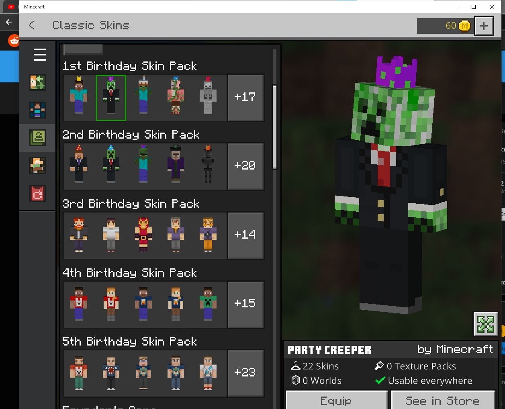

# MCPE 스킨팩 (스킨팩 인젝션)

---

Language selector / 言語選択 / 언어 선택：
- [繁體中文](README.md)
- [English](README.en.md)
- [日本語](README.ja.md)

---

## 📖 소개

> **이 문서는 AI의 도움을 받아 생성되었습니다. 작성자는 내용의 절대적인 정확성에 대해 책임을 지지 않습니다.**

이 프로젝트는 마인크래프트 베드락 에디션(MCPE)을 위한 고품질 스킨팩과 암호화 도구를 제공합니다.
**'스킨팩 인젝션(캐시 교체 기술)'**을 사용하여 `skins.json`, `.lang` 및 스킨 텍스처 파일을 수정하고 암호화함으로써 공식 마켓플레이스 스킨팩을 커스텀 스킨으로 교체합니다. 이를 통해 멀티플레이어와 서버에서도 스킨이 정상적으로 표시될 수 있습니다.

⚠️ **면책 조항**: 본 프로젝트와 도구는 기술 교류 및 개인 맞춤 설정을 위해서만 제공됩니다. 상업적 이익을 위해 사용하지 마십시오. 게임 파일 수정으로 인한 게임 크래시나 데이터 손실에 대해 제작자는 어떠한 책임도 지지 않습니다. 작업을 진행하기 전에 반드시 백업하시기 바랍니다.

## 📁 파일 구조 설명

- `pack/` — 핵심 리소스 폴더입니다. 암호화되지 않은 커스텀 파일(`skins.json`, `geometry.json`, 이미지 파일 및 `texts/` 언어 파일)이 포함되어 있습니다.
- `도구 파일` — 일반 텍스트 파일을 게임에서 읽을 수 있는 암호화된 형식으로 변환하고 서명을 생성하는 프로그램입니다.
- `.gitignore` — 개발 중 생성된 임시 파일(예: `temp/`)을 제외합니다. 이 파일들은 공식 릴리스에 포함되지 않습니다.

## ⚙️ 설치 및 교체 단계

스킨팩이 게임에 성공적으로 로드되도록 아래 단계를 엄격히 따라주세요.

### 1단계: 공식 캐시 폴더 위치 찾기
Windows 11에서 파일 탐색기를 열고 아래의 캐시 경로로 이동하여 "교체/덮어쓰기"할 공식 스킨팩을 찾습니다 (사전에 마켓플레이스에서 해당 팩을 다운로드해야 합니다):
> **기본 경로:** 
> `C:\Users\사용자_이름\AppData\Roaming\Minecraft Bedrock\premium_cache\skin_packs\`
> *(폴더 이름은 보통 `u9bQ7FAljNM=`와 같이 알아볼 수 없는 문자열로 되어 있습니다)*

### 2단계: 대상 폴더 선택 및 정리 (⚠️ 매우 중요)
1. **대상 선택**: 교체 성공 후 탈의실(Dressing Room)에서 찾기 쉽도록 식별하기 쉬운 공식 스킨팩(예: **"1st Birthday Skin Pack"**)을 선택하는 것을 권장합니다.
2. **신분증 유지**: 공식 스킨팩의 알 수 없는 문자열 폴더로 들어간 후, **반드시 공식 원본 `manifest.json`을 유지해야 합니다** (이것은 공식 팩의 신분증이므로 절대 삭제하면 안 됩니다).
3. **내용 비우기**: 폴더 내에서 `manifest.json`을 제외한 **모든 공식 파일을 삭제**합니다.

### 3단계: 커스텀 스킨 파일 삽입
이 프로젝트의 `pack/` 폴더 내에 있는 모든 콘텐츠(커스텀 스킨, `.lang`, `skins.json` 등)를 복사하여 방금 정리한 공식 스킨팩 폴더 안에 붙여넣습니다.
*(이 시점에서 대상 폴더에는 공식 `manifest.json`과 방금 붙여넣은 커스텀 파일만 있어야 합니다)*

### 4단계: 암호화 도구를 사용한 제자리 처리
베드락 에디션은 파일에 대한 암호화 유효성 검사를 수행하므로 그대로 게임을 실행하면 읽을 수 없습니다. 프로젝트에 포함된 암호화 도구를 사용하여 마지막 위장 작업을 수행하세요:
1. 프로젝트 내의 암호화 도구 `encryptor.exe`를 실행합니다.
2. 도구의 프롬프트에 따라 **[2단계]의 알 수 없는 공식 스킨팩 폴더 경로**를 붙여넣습니다.
3. 도구가 폴더 내 모든 파일의 암호화 프로세스를 자동으로 처리하고, 필요한 디지털 서명(`signatures.json` 등)을 제자리에 생성합니다.

### 5단계: 게임 재시작
마인크래프트를 실행하고 탈의실로 들어갑니다. 원래의 공식 스킨팩이 이제 본 프로젝트의 커스텀 스킨과 커스텀 이름(`.lang` 파일로 제어됨)으로 표시될 것입니다!

## 🛠️ 기여 및 스킨 추가 방법

모딩 메커니즘에 익숙한 플레이어의 PR(Pull Request)을 환영합니다:
1. `pack/skins.json`에 스킨 설정 배열을 추가하고 해당 이미지 파일을 `pack/` 경로에 맞게 넣습니다.
2. `pack/texts/` 안의 언어 파일(`.lang`)을 수정하여 스킨 표시 이름을 설정합니다.
3. 암호화를 테스트하고 게임 내에서 문제없이 작동하는지 확인한 후 PR을 제출하세요.
*( `.gitignore`에서 제외된 임시 파일이나 무관한 암호화 결과물을 PR에 포함하지 마십시오 )*

## 📄 라이선스

권장 라이선스: **CC BY-NC-SA 4.0** (저작자표시-비영리-동일조건변경허락 4.0 국제).
- **비영리**: 본 프로젝트 콘텐츠 또는 수정된 파일을 유료 배포나 수익 창출 목적으로 사용하지 마십시오.
- **동일조건변경허락**: 수정 및 최적화는 환영하지만, 재배포 시 동일한 라이선스를 적용하고 원작자를 표시해야 합니다.

**연락처**: 주요 작성자 정보는 `pack/texts/en_US.lang` (`MondayHP`)에 기재되어 있습니다.